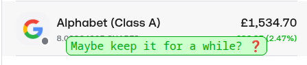
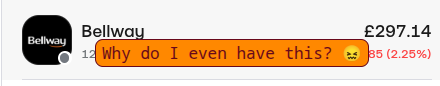
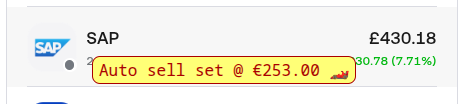
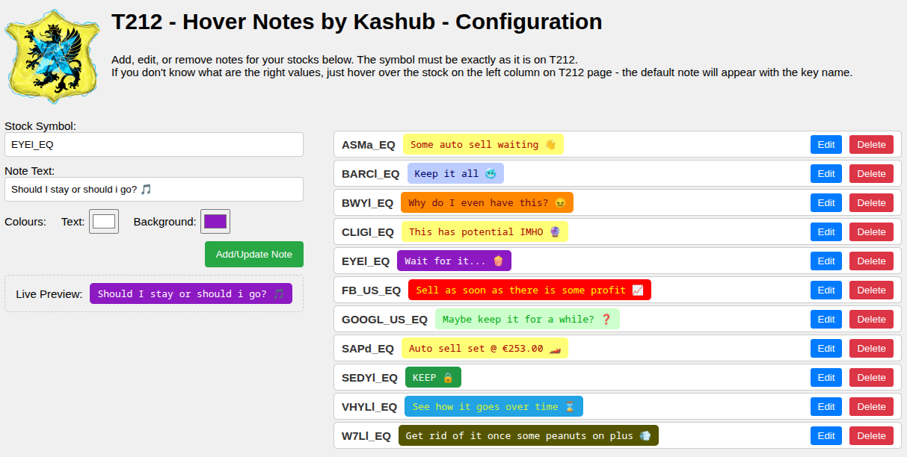
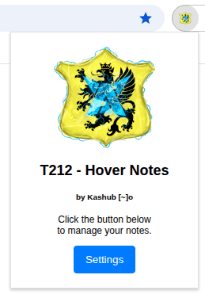

# My Hover Notes 🚀

Ever feel like you need a tiny, unobtrusive sticky note for your stocks on T212? I built this because I kept forgetting what I wanted to do with a stock—was it a long-term hold? A quick trade? I needed a note right where I could see it, in the same place I make my moves. So here it is! A simple tool for a very real problem.

## Features ✨

* **Hover Notes**: Add custom notes that appear instantly when you hover over a stock ticker.
* **Custom Colors**: Personalize your notes with custom text and background colors.
* **Live Preview**: See what your note will look like before you save it.
* **Easy Editing**: Edit or delete notes with a single click from the configuration page.

---

### Note in Action

See how the notes appear on the T212 website when you hover over a stock.

---

### Configuration Page

This is where you add, edit, and manage all your notes.

---

### Pop-up Window

A quick and easy way to access the extension's settings.

---

## How to Install (for developers) 👩‍💻

1.  Clone this repository to your local machine.
2.  Open Google Chrome and navigate to `chrome://extensions`.
3.  Enable **Developer mode** in the top-right corner.
4.  Click **Load unpacked** and select the folder where you cloned this repository.

That's it! The extension should now be active in your browser.

---

## Disclaimer ⚠️

This extension is provided "as-is" and without warranty. It's a personal project for personal use. I take no responsibility for any decisions you make on T212 - or anywhere else - based on a note you wrote while half-asleep. Use at your own risk!